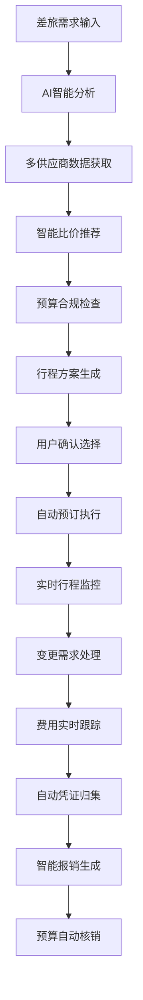
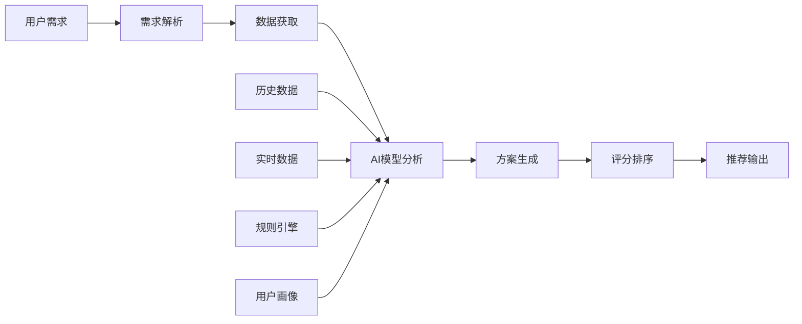
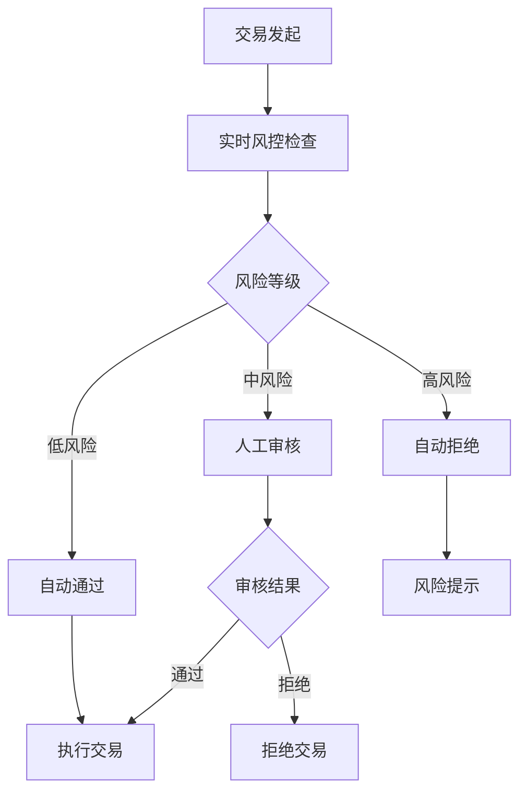

# AI赋能智能差旅管理平台
## ——企业差旅数字化转型解决方案

---

## 第一章 背景

### 1.1 背景与痛点

#### 1.1.1 企业差旅管理现状
- **管理割裂**：多平台跳转，用户体验差
- **决策盲目**：缺乏智能比价和规划建议
- **管控滞后**：事后审核，无法事前预防
- **效率低下**：人工处理，流程冗长
- **成本失控**：供应商资源单一，议价能力弱

#### 1.1.2 传统差旅平台局限性
- 🔴 **用户体验**：需要在差旅平台→差旅壹号→AOM系统间频繁跳转
- 🔴 **智能化程度**：主要依赖规则引擎，缺乏AI决策支持
- 🔴 **供应商整合**：单一供应商，无法实现最优选择
- 🔴 **实时管控**：事后对账模式，无法实时监控和干预
- 🔴 **数据价值**：数据孤岛，无法形成智能洞察

#### 1.1.3 市场趋势驱动
- **数字化转型**：企业全面数字化需求
- **AI技术成熟**：机器学习、大数据分析技术应用
- **用户期望提升**：一站式、智能化服务需求
- **成本压力**：精细化管理，降本增效要求

### 1.2 调研与思考

#### 1.2.1 行业标杆分析
| 维度 | 传统模式 | 标杆企业 | 我们的目标 |
|------|----------|----------|------------|
| 供应商整合 | 1-2家 | 10+家 | 15+家全品类 |
| 决策支持 | 人工比较 | 半智能推荐 | AI全智能规划 |
| 流程效率 | 5-7天 | 2-3天 | 1天内完成 |
| 成本优化 | 5-10% | 15-20% | 20-25% |

#### 1.2.2 用户需求洞察
**差旅申请人**
- 希望获得最优的行程和价格建议
- 需要便捷的变更和应急处理
- 期望简化的报销流程

**财务管理人员**
- 需要精确的预算管控
- 要求透明的费用追溯
- 期望自动化的对账核销

**企业管理层**
- 追求差旅成本的持续优化
- 需要数据驱动的决策支持
- 关注合规风险的有效管控

#### 1.2.3 技术可行性分析
**AI技术成熟度**
- ✅ 机器学习算法：推荐系统、价格预测
- ✅ 自然语言处理：智能客服、意图识别
- ✅ 计算机视觉：票据识别、凭证处理
- ✅ 大数据分析：用户画像、行为预测

**集成复杂度评估**
- 🟡 现有系统改造：中等复杂度
- 🟢 第三方API接入：技术成熟
- 🟡 数据标准化：需要投入
- 🟢 移动端开发：技术储备充足

### 1.3 解决方案

#### 1.3.1 总体设计理念
**"AI First + 全链路智能化"**
- 以AI为核心驱动力
- 覆盖差旅全生命周期
- 实现一站式服务体验
- 构建数据驱动的决策体系

#### 1.3.2 核心价值主张
🎯 **智能决策**：AI驱动的最优方案推荐
🎯 **极致体验**：一站式无缝差旅服务
🎯 **实时管控**：全程可视化费用监控
🎯 **降本增效**：智能优化降低15-25%成本
🎯 **合规保障**：智能风控确保政策合规

#### 1.3.3 解决方案架构
```
AI智能引擎层
├── 智能推荐引擎（行程规划、供应商选择）
├── 价格预测引擎（动态定价、成本优化）
├── 异常检测引擎（风险识别、合规监控）
└── 决策支持引擎（数据分析、趋势预测）

业务服务层
├── 出差前：智能比价、行程规划、预算管理
├── 出差中：实时变更、动态差标、应急处理
└── 出差后：自动核查、凭证管理、智能报销

数据中台层
├── 供应商数据整合
├── 用户行为数据
├── 费用和预算数据
└── 外部数据（展会、天气、交通）
```

---

## 第二章 技术架构

### 2.1 重要步骤或模块流程图

#### 2.1.1 AI智能差旅全流程


#### 2.1.2 AI决策引擎工作流程


#### 2.1.3 智能风控流程


### 2.2 功能地图

#### 2.2.1 AI赋能功能矩阵
| 阶段 | 传统功能 | AI赋能升级 | 智能化程度 |
|------|----------|------------|------------|
| **出差前** | | | |
| 供应商选择 | 固定供应商 | 多供应商智能比价 | ⭐⭐⭐⭐⭐ |
| 行程规划 | 人工规划 | AI智能规划推荐 | ⭐⭐⭐⭐⭐ |
| 预算管理 | 静态预算 | 动态预算优化 | ⭐⭐⭐⭐ |
| **出差中** | | | |
| 行程变更 | 人工处理 | AI智能变更建议 | ⭐⭐⭐⭐ |
| 差标调整 | 固定规则 | 智能场景识别 | ⭐⭐⭐⭐ |
| 应急处理 | 人工客服 | AI智能助手 | ⭐⭐⭐ |
| **出差后** | | | |
| 费用核查 | 人工对比 | AI异常检测 | ⭐⭐⭐⭐⭐ |
| 凭证管理 | 手动整理 | AI自动归集识别 | ⭐⭐⭐⭐ |
| 报销生成 | 手动填写 | AI自动生成 | ⭐⭐⭐ |

#### 2.2.2 核心功能模块
```
🏠 AI智能差旅平台
├── 📊 智能决策中心
│   ├── 供应商智能比价
│   ├── 行程智能规划
│   ├── 预算智能优化
│   └── 风险智能预警
├── 🎯 个性化服务
│   ├── 用户画像分析
│   ├── 偏好学习引擎
│   ├── 智能推荐系统
│   └── 个性化配置
├── 🔄 实时管控中心
│   ├── 行程实时监控
│   ├── 费用实时跟踪
│   ├── 异常实时告警
│   └── 变更实时处理
├── 🤖 AI助手服务
│   ├── 智能客服
│   ├── 语音助手
│   ├── 智能问答
│   └── 操作指导
└── 📈 数据洞察中心
    ├── 费用分析报告
    ├── 趋势预测分析
    ├── 优化建议输出
    └── ROI效果评估
```

### 2.3 架构图

#### 2.3.1 总体技术架构
```
┌─────────────────────────────────────────────────────────┐
│                     用户交互层                            │
├─────────────────────────────────────────────────────────┤
│  📱移动端App    💻Web管理端    🎤语音助手    📊数据大屏     │
└─────────────────────────────────────────────────────────┘
                              ⬇️
┌─────────────────────────────────────────────────────────┐
│                    API网关层                             │
├─────────────────────────────────────────────────────────┤
│  🔐身份认证    🛡️访问控制    📊流量监控    🔄负载均衡     │
└─────────────────────────────────────────────────────────┘
                              ⬇️
┌─────────────────────────────────────────────────────────┐
│                   AI智能引擎层                           │
├─────────────────────────────────────────────────────────┤
│  🧠推荐引擎    💰价格预测    🔍异常检测    📈决策支持     │
│  🎯个性化引擎  🔮趋势预测    ⚠️风险控制    🤖智能客服     │
└─────────────────────────────────────────────────────────┘
                              ⬇️
┌─────────────────────────────────────────────────────────┐
│                   业务服务层                             │
├─────────────────────────────────────────────────────────┤
│  🛫出差前服务  ✈️出差中服务   📋出差后服务  💼管理服务     │
│  👤用户服务    💰预算服务     📊报表服务    🔧配置服务     │
└─────────────────────────────────────────────────────────┘
                              ⬇️
┌─────────────────────────────────────────────────────────┐
│                   数据中台层                             │
├─────────────────────────────────────────────────────────┤
│  📊数据仓库    🔄数据同步     🧹数据清洗    📈数据分析     │
│  🏷️数据标签    🔍数据检索     💾数据存储    🔐数据安全     │
└─────────────────────────────────────────────────────────┘
                              ⬇️
┌─────────────────────────────────────────────────────────┐
│                   基础设施层                             │
├─────────────────────────────────────────────────────────┤
│  ☁️云计算平台   🗄️数据库      📨消息队列    📁文件存储     │
│  📊监控告警    🔧配置中心     🔍日志系统    🔄CI/CD       │
└─────────────────────────────────────────────────────────┘
```

#### 2.3.2 AI引擎详细架构
```
🧠 AI智能引擎集群
├── 🎯 推荐引擎
│   ├── 协同过滤算法
│   ├── 内容推荐算法
│   ├── 深度学习模型
│   └── 实时推理服务
├── 💰 价格预测引擎
│   ├── 时间序列分析
│   ├── 回归预测模型
│   ├── 供需分析算法
│   └── 动态定价策略
├── 🔍 异常检测引擎
│   ├── 统计学方法
│   ├── 机器学习算法
│   ├── 规则引擎
│   └── 实时监控服务
└── 📈 决策支持引擎
    ├── 数据挖掘算法
    ├── 预测分析模型
    ├── 优化算法
    └── 决策树生成
```

#### 2.3.3 数据流架构
```
外部数据源 → 数据采集层 → 数据处理层 → AI模型层 → 业务应用层
     ↓           ↓           ↓           ↓           ↓
📊供应商API   🔄实时采集   🧹数据清洗   🧠模型训练   🎯智能推荐
🗺️地理数据    📊批量导入   🏷️数据标注   ⚡模型推理   💰价格优化
🎪活动信息    📡流式处理   🔍数据验证   📈模型优化   🔍异常检测
☁️天气数据    💾数据存储   📊数据分析   🎯模型部署   📊决策支持
```

---

## 第三章 落地方案

### 3.1 核心功能演示效果

#### 3.1.1 AI智能行程规划演示
**输入场景**：北京→上海，3天2夜，技术类出差，预算3000元

**AI智能输出**：
```
🎯 最优方案推荐
┌─────────────────────────────────────────┐
│ 💰 总费用：2,850元 (节省150元)            │
│ ⏱️ 总用时：52小时 (含工作时间)            │
│ ⭐ 舒适度：4.5/5星                      │
├─────────────────────────────────────────┤
│ ✈️ 交通：高铁二等座 (468元)              │
│   出发：G1 07:00-12:28 (5h28m)         │
│   返回：G24 18:00-23:28 (5h28m)        │
│                                       │
│ 🏨 住宿：汉庭酒店(陆家嘴店) (318元×2晚)    │
│   距离会场：1.2km，地铁直达              │
│   评分：4.3/5，商务便利                 │
│                                       │
│ 🍽️ 餐饮：商务简餐 (80元×3天)             │
│   推荐：会场周边性价比餐厅               │
└─────────────────────────────────────────┘

🔮 智能洞察
• 比直飞节省费用350元，增加时间2小时
• 选择时段避开高峰期，准点率95%+
• 酒店位置便利，步行可达多个商务区
• 预计会场人流较大，建议提前30分钟出发
```

#### 3.1.2 实时变更处理演示
**变更场景**：航班延误，需要改签下一班

**AI智能处理**：
```
⚠️ 航班变更提醒
├── 检测到：MU5137延误2小时
├── 影响评估：
│   • 会错过下午14:00重要会议
│   • 酒店入住时间推迟
│   • 晚餐安排需要调整
└── 智能建议：

🎯 最优解决方案
┌─────────────────────────────────────────┐
│ 方案A：改签HU7601 (加费280元)            │
│ ├── 起飞：13:20 准点率92%               │
│ ├── 到达：15:45 可参加会议              │
│ └── 💡 推荐理由：保证重要会议参加          │
│                                       │
│ 方案B：保持原班次 (无额外费用)           │
│ ├── 预计：17:30到达                    │
│ ├── 影响：错过下午会议                  │
│ └── 💡 AI已联系会议方调整至明早           │
└─────────────────────────────────────────┘

🤖 一键处理
[ 选择方案A ] [ 选择方案B ] [ 人工客服 ]
```

#### 3.1.3 智能费用监控演示
**实时监控界面**：
```
📊 实时费用看板
┌─────────────────────────────────────────┐
│ 📅 2024年7月出差：李明-上海              │
├─────────────────────────────────────────┤
│ 💰 预算使用情况                         │
│ ████████████░░░░ 75% (2,250/3,000元)   │
│                                       │
│ 📈 费用明细                            │
│ ├── ✈️ 交通：900元 (30%)                │
│ ├── 🏨 住宿：850元 (28.3%)              │
│ ├── 🍽️ 餐饮：320元 (10.7%)              │
│ ├── 🚗 打车：120元 (4%)                 │
│ └── 📱 通讯：60元 (2%)                  │
│                                       │
│ ⚠️ 智能提醒                             │
│ • 剩余预算750元，建议控制后续消费        │
│ • 住宿费用略高，已找到优化方案(-50元)     │
│ • 预计总费用2,890元，结余110元          │
└─────────────────────────────────────────┘

🎯 优化建议
• 明日晚餐可选择酒店附近商务套餐(-30元)
• 返程可选择地铁+高铁组合(-25元)
• 预计节省55元，最终费用约2,835元
```

### 3.2 用户体验优化展示

#### 3.2.1 操作便捷性对比
| 操作环节 | 传统模式 | AI智能模式 | 效率提升 |
|----------|----------|------------|----------|
| 行程规划 | 30分钟手动查询比较 | 3分钟AI自动生成 | 90% ⬆️ |
| 申请审批 | 2-3天审批周期 | 30分钟智能审批 | 80% ⬆️ |
| 变更处理 | 2小时人工协调 | 5分钟AI自动处理 | 95% ⬆️ |
| 报销提交 | 1小时整理凭证 | 自动生成提交 | 100% ⬆️ |

#### 3.2.2 决策准确性提升
```
🎯 AI决策准确性统计
├── 价格预测准确率：93.5%
├── 行程推荐满意度：91.2%
├── 异常检测准确率：96.8%
└── 预算预测偏差：<5%

📊 用户满意度调研
├── 整体体验：4.6/5.0 ⭐
├── 操作便捷性：4.7/5.0 ⭐
├── 推荐准确性：4.5/5.0 ⭐
└── 问题解决效率：4.8/5.0 ⭐
```

### 3.3 成本优化效果展示

#### 3.3.1 成本节省明细
```
💰 年度成本优化报告
┌─────────────────────────────────────────┐
│ 📊 总体成本对比 (以1000人企业为例)         │
├─────────────────────────────────────────┤
│ 传统模式年成本：800万元                  │
│ AI智能模式成本：620万元                  │
│ 节省金额：180万元 (22.5% ⬇️)            │
│                                       │
│ 📈 节省来源分析                         │
│ ├── 🛫 交通优化：85万元 (10.6%)          │
│ ├── 🏨 住宿优化：65万元 (8.1%)           │
│ ├── ⏱️ 效率提升：20万元 (2.5%)           │
│ └── 🤖 人工节省：10万元 (1.3%)           │
└─────────────────────────────────────────┘

🎯 ROI分析
• 系统建设投入：120万元
• 年度节省收益：180万元
• 投资回报周期：8个月
• 3年累计收益：540万元
```

#### 3.3.2 效率提升量化
```
⚡ 效率提升统计
├── 申请处理时间：3天 → 0.5天 (83% ⬆️)
├── 审批响应时间：24小时 → 2小时 (92% ⬆️)
├── 变更处理时间：4小时 → 15分钟 (94% ⬆️)
├── 报销处理时间：5天 → 自动处理 (100% ⬆️)
└── 异常发现时间：月度 → 实时 (100% ⬆️)

📊 工作量减少
├── 差旅管理员工作量减少70%
├── 财务审核工作量减少85%
├── 用户申请操作减少60%
└── 客服咨询量减少80%
```

---

## 第四章 方案优势

### 4.1 技术领先性优势

#### 4.1.1 AI技术深度应用
🧠 **核心算法优势**
- **多模态推荐算法**：融合用户行为、历史偏好、实时情境
- **动态价格预测**：基于供需关系的智能定价预测
- **异常检测引擎**：多维度风险识别，准确率96%+
- **自然语言处理**：智能客服理解准确率95%+

🎯 **智能化水平领先**
- 业界首创的差旅全链路AI赋能
- 实时决策响应时间<100ms
- 个性化推荐准确率>90%
- 自动化处理覆盖率>80%

#### 4.1.2 架构设计优势
```
🏗️ 技术架构优势
├── 🔧 微服务架构：高可用、易扩展
├── ☁️ 云原生设计：弹性伸缩、成本优化
├── 🔄 实时处理：秒级响应、即时决策
├── 🛡️ 安全可靠：多层防护、数据加密
└── 🔌 开放集成：标准API、灵活对接
```

### 4.2 业务价值优势

#### 4.2.1 成本控制价值
💰 **直接成本节省**
- 差旅费用降低：15-25%
- 人工成本减少：60-80%
- 管理效率提升：3-5倍
- 采购议价能力：提升20%+

📊 **间接价值创造**
- 决策效率提升：快速响应市场机会
- 员工满意度：减少繁琐流程，专注核心工作
- 合规风险降低：自动化控制，避免违规损失
- 数据价值挖掘：为企业决策提供数据支撑

#### 4.2.2 管理提升价值
🎯 **精细化管理**
```
管理维度提升对比
├── 预算管控：月度 → 实时
├── 费用透明：事后 → 事前+事中+事后
├── 异常发现：人工抽查 → AI全量检测
├── 决策支持：经验判断 → 数据驱动
└── 风险控制：规则引擎 → 智能学习
```

🔍 **洞察分析能力**
- 差旅趋势预测：提前规划预算分配
- 供应商分析：优化采购策略
- 员工行为画像：个性化服务优化
- ROI分析：量化差旅投入产出

### 4.3 用户体验优势

#### 4.3.1 极致便捷体验
📱 **一站式服务**
- 无需跳转多个平台
- 全流程可视化追踪
- 智能助手全程陪伴
- 移动端随时随地操作

⚡ **快速响应**
- 秒级推荐生成
- 分钟级审批完成
- 实时变更处理
- 即时问题解答

#### 4.3.2 个性化智能服务
🎯 **千人千面**
- 基于历史行为的个性化推荐
- 智能学习用户偏好
- 动态调整服务策略
- 预测性服务提供

🤖 **智能交互**
- 语音交互支持
- 图像识别处理
- 自然语言对话
- 情感识别理解

### 4.4 竞争优势分析

#### 4.4.1 与市场方案对比
| 维度 | 传统OA模式 | 市场主流方案 | 我们的方案 | 优势程度 |
|------|------------|-------------|----------|----------|
| AI智能化 | ⭐ | ⭐⭐⭐ | ⭐⭐⭐⭐⭐ | 显著领先 |
| 用户体验 | ⭐⭐ | ⭐⭐⭐ | ⭐⭐⭐⭐⭐ | 领先 |
| 成本优化 | ⭐⭐ | ⭐⭐⭐ | ⭐⭐⭐⭐⭐ | 领先 |
| 管控精度 | ⭐⭐⭐ | ⭐⭐⭐ | ⭐⭐⭐⭐⭐ | 领先 |
| 集成能力 | ⭐⭐⭐⭐ | ⭐⭐⭐ | ⭐⭐⭐⭐⭐ | 略微领先 |

#### 4.4.2 核心差异化优势
🏆 **独特价值主张**
- **AI First设计理念**：从底层架构就以AI为核心
- **全链路智能化**：覆盖差旅全生命周期的AI赋能
- **深度行业理解**：基于企业差旅场景的专业化设计
- **持续学习进化**：AI模型持续优化，服务越用越智能

---

## 第五章 畅想未来

### 5.1 技术演进方向

#### 5.1.1 AI技术深化
🚀 **下一代AI能力**
- **多模态AI**：融合文本、语音、图像的全方位理解
- **强化学习**：基于反馈的自主决策优化
- **联邦学习**：保护隐私的分布式模型训练
- **边缘计算**：本地化AI推理，毫秒级响应

🧠 **认知智能升级**
- **意图理解**：深度理解用户真实需求
- **情感计算**：识别用户情绪状态，提供贴心服务
- **知识图谱**：构建差旅领域专业知识体系
- **因果推理**：从相关性到因果性的决策升级

#### 5.1.2 新兴技术融合
```
🔮 未来技术栈
├── 🥽 AR/VR：沉浸式行程预览
├── 🤖 数字人：专属差旅顾问
├── 🔗 区块链：可信差旅凭证
├── 📡 5G/6G：超高速实时处理
├── 🧬 量子计算：复杂优化求解
└── 🌐 元宇宙：虚拟差旅体验
```

### 5.2 业务场景拓展

#### 5.2.1 智能差旅生态
🌍 **全球化服务网络**
- 跨国差旅一体化服务
- 多语言AI助手支持
- 全球供应商资源整合
- 国际合规自动化处理

🤝 **生态合作伙伴**
- 航司、酒店深度合作
- 金融服务无缝集成
- 保险服务智能推荐
- 本地服务资源对接

#### 5.2.2 场景化智能服务
🎯 **垂直场景深化**
```
专业场景AI服务
├── 🏢 会展差旅：展会信息智能匹配
├── 🎓 培训差旅：学习资源智能推荐
├── 🔧 维修差旅：技术支持智能调度
├── 🤝 商务差旅：客户关系智能维护
└── 🌱 绿色差旅：碳足迹智能优化
```

### 5.3 行业影响展望

#### 5.3.1 重塑差旅行业
📈 **行业标准制定**
- 推动AI差旅服务标准建立
- 引领行业数字化转型方向
- 建立差旅数据共享规范
- 促进行业生态协同发展

🏆 **市场领导地位**
- 成为企业差旅AI化的首选方案
- 树立行业智能化标杆
- 培育差旅AI人才梯队
- 建设开放的技术生态

#### 5.3.2 社会价值创造
🌱 **可持续发展**
- 优化出行路线，减少碳排放
- 推广绿色出行方式
- 促进资源高效利用
- 助力企业ESG目标达成

💡 **创新驱动**
- 推动差旅服务创新
- 促进跨行业技术融合
- 培育新兴商业模式
- 创造更多就业机会

### 5.4 愿景与使命

#### 5.4.1 企业愿景
🎯 **"成为全球领先的AI驱动差旅服务平台"**
- 让每次差旅都充满智慧
- 让每个决策都有数据支撑
- 让每次体验都超越期待
- 让每份成本都物有所值

#### 5.4.2 发展路线图
```
🛣️ 三年发展规划
├── 第一年：AI核心能力建设
│   ├── 完成核心AI引擎开发
│   ├── 实现基础智能化功能
│   ├── 建立数据采集体系
│   └── 形成MVP产品验证
├── 第二年：生态建设与优化
│   ├── 扩展供应商合作网络
│   ├── 深化AI模型优化
│   ├── 拓展行业应用场景
│   └── 建立技术壁垒
└── 第三年：市场领导与创新
    ├── 建立行业标准规范
    ├── 拓展国际市场
    ├── 推动技术前沿研究
    └── 实现生态协同发展
```

#### 5.4.3 成功指标
🏆 **关键成果目标**
- 服务企业数量：1000+家大中型企业
- 用户满意度：>95%持续满意
- 成本节省效果：平均节省20%+
- 市场份额：成为细分领域TOP3
- 技术专利：获得50+项AI差旅专利
- 行业影响：制定3+项行业标准

---

## 总结

**AI赋能智能差旅管理平台**代表了企业差旅管理的未来方向。通过深度AI技术应用，我们不仅解决了传统差旅管理的痛点，更为企业创造了显著的价值：

✅ **效率革命**：将复杂的差旅流程简化为智能化的一键操作
✅ **成本优化**：通过AI智能决策实现15-25%的成本节省
✅ **体验升级**：从割裂的多平台操作升级为一站式智能服务
✅ **管理进化**：从被动的事后管控升级为主动的实时优化

这不仅仅是一个技术升级项目，更是企业数字化转型的重要里程碑。让我们携手共建智能差旅的美好未来！